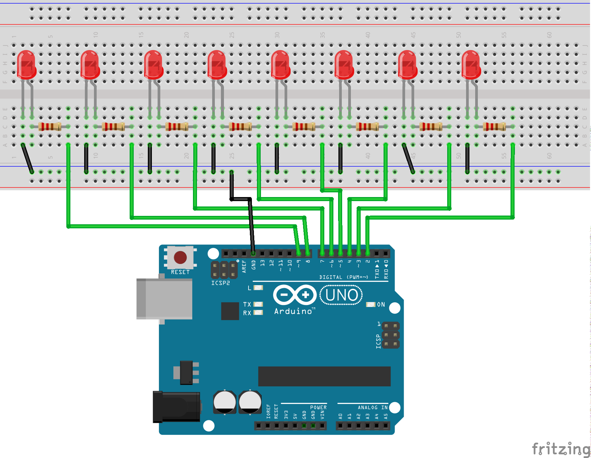

## POV Demo

A simple POV (persistence of vision) demo project using 8 LEDs to show a text. 

After running the sketch the LEDs are rapidly blinking in a seemingly random pattern.

But when moving the LEDs quickly you should recognize some text.

## Wiring

